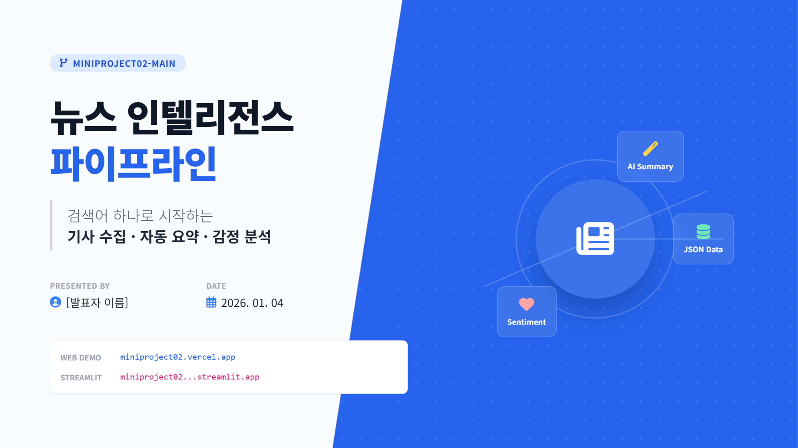

# 뉴스 요약 · 감정 분석 웹앱

NewsAPI로 최신 기사를 수집하고, 요약/감정 분석 결과를 웹에서 확인하는 서비스입니다.  
Streamlit 통합 실행을 기본으로 하며, 필요 시 React + FastAPI 분리 실행도 가능합니다.

- 📌 발표자료(PPT): [다운로드](docs/presentation.pptx)



# 데모 사이트 (리엑트/스트림잇 free trial ver.)
https://miniproject02.vercel.app/

https://miniproject02git-u7cjmwvvr2xj2j7qhoru8g.streamlit.app/

---

## 목차
- [개요](#개요)
- [주요 기능](#주요-기능)
- [기술 스택](#기술-스택)
- [프로젝트 구조](#프로젝트-구조)
- [빠른 시작](#빠른-시작)
- [환경 변수](#환경-변수)
- [API 엔드포인트](#api-엔드포인트)
- [데이터 스키마](#데이터-스키마)
- [배포](#배포)
- [라이선스](#라이선스)
- [기여](#기여)

---

## 개요
키워드를 입력하면 최신 뉴스를 수집하고, 텍스트 정규화 → 요약 → 감정분석을 거쳐 고정 JSON 스키마로 반환합니다.  
Streamlit 웹 UI의 API 설정 다이얼로그에서 NewsAPI/OpenAI 키, 모델, Hugging Face 옵션을 바로 바꿔 결과를 비교하고, JSON 저장/불러오기도 지원합니다.

## 주요 기능
- 뉴스 수집: NewsAPI 호출
- 텍스트 정규화: 제목/요약/본문 병합 및 공백 정리
- 요약: OpenAI 또는 로컬 스텁/옵션 모델
- 감정분석: OpenAI 또는 로컬 스텁/옵션 모델
- JSON 저장/불러오기
- 웹 UI: 목록 + 상세 보기 (Streamlit 통합)

## 기술 스택
### Backend
| 기술 | 버전 | 용도 |
|------|------|------|
| Python | 3.10+ | 언어 |
| FastAPI | 최신 | API 서버(선택) |
| Uvicorn | 최신 | ASGI 서버(선택) |
| Requests | 최신 | NewsAPI 호출 |
| OpenAI SDK | 선택 | 요약/감정 분석 |
| Streamlit | 최신 | 통합 UI |

### Frontend
| 기술 | 버전 | 용도 |
|------|------|------|
| React | 18+ | UI |
| Vite | 최신 | 빌드/개발 서버 |

## 프로젝트 구조
```
miniproject02/
  backend/
    app/
      main.py
      pipeline.py
      news_client.py
      summarizer.py
      sentiment.py
      text_utils.py
    requirements.txt
  frontend/
    src/
      App.jsx
      App.css
      index.css
  streamlit_app.py
```

---

## 빠른 시작

### 사전 요구사항
- Python 3.10+
- Node.js 18+
- NewsAPI 키
- (선택) OpenAI API 키

### Streamlit 통합 실행
```powershell
cd C:\Users\ysj08\Documents\miniproject02
pip install -r backend\requirements.txt
$env:NEWS_API_KEY="YOUR_NEWSAPI_KEY"
$env:OPENAI_API_KEY="YOUR_OPENAI_KEY"   # 선택
$env:OPENAI_MODEL="gpt-3.5-turbo"       # 선택
streamlit run streamlit_app.py
```
브라우저에서 `http://localhost:8501` 접속 후 사용합니다.

### (선택) FastAPI + React 실행
Backend:
```powershell
cd C:\Users\ysj08\Documents\miniproject02\backend
pip install -r requirements.txt
$env:NEWS_API_KEY="YOUR_NEWSAPI_KEY"
$env:OPENAI_API_KEY="YOUR_OPENAI_KEY"   # 선택
$env:OPENAI_MODEL="gpt-3.5-turbo"       # 선택
uvicorn app.main:app --reload --host 0.0.0.0 --port 8000
```

Frontend:
```powershell
cd C:\Users\ysj08\Documents\miniproject02\frontend
cmd /c "npm install"
cmd /c "npm run dev"
```
브라우저에서 `http://localhost:5173` 접속 후 사용합니다.

---

## 환경 변수 & API 설정
- `.env`에 키/모델/옵션을 기록하면 Streamlit 앱의 **API 설정** 팝업에서 즉시 불러옵니다. 예:
  ```
  NEWS_API_KEY=your-newsapi
  OPENAI_API_KEY=your-openai-key
  OPENAI_MODEL=gpt-3.5-turbo
  USE_OPENAI=1
  USE_TRANSFORMERS_SUMMARY=1
  USE_VADER=1
  SUMMARY_ENGINE=auto
  SUMMARY_HF_MODEL=ainize/kobart-news
  SENTIMENT_ENGINE=auto
  SENTIMENT_HF_MODEL=snunlp/KR-FinBert-SC
  ```
- `NEWS_API_KEY`는 필수이며, OpenAI 키가 없으면 Hugging Face → 스텁(또는 룰 기반) 순으로 폴백합니다.
- `.env`는 `.gitignore`에 올라가 있으므로 API 키를 포함해 커밋하지 마세요. 필요하면 `.env.example`로 템플릿만 제공하면 됩니다.

## API 엔드포인트
### 헬스 체크
| Method | Endpoint | Description |
|--------|----------|-------------|
| GET | `/api/health` | 서버 상태 확인 |

### 뉴스 수집
| Method | Endpoint | Description |
|--------|----------|-------------|
| POST | `/api/fetch` | 뉴스 수집 + 요약 + 감정 분석 |

요청 예시:
```json
{
  "query": "AI",
  "page_size": 5,
  "language": "en",
  "sort_by": "publishedAt"
}
```

---

## 데이터 스키마
```json
{
  "query": "...",
  "language": "en",
  "fetched_at": "ISO8601",
  "articles": [
    {
      "id": "url-hash",
      "title": "...",
      "url": "...",
      "source": "...",
      "publishedAt": "...",
      "text": "...",
      "summary": "...",
      "sentiment": {"label": "...", "score": 0.0, "model": "..."}
    }
  ]
}
```

---

## 배포

### Streamlit Community Cloud
- App file: `streamlit_app.py`
- Secrets: `NEWS_API_KEY`, `OPENAI_API_KEY`(선택), `OPENAI_MODEL`(선택)
- 참고: Streamlit Cloud는 **repo 루트의 `requirements.txt`**를 읽습니다.  
  필요하면 `backend/requirements.txt`를 루트로 복사해서 커밋하세요.

### Render + Vercel (선택)
- Render(백엔드): `backend` 폴더 배포
- Vercel(프론트): `frontend` 폴더 배포 + `VITE_API_BASE` 설정

---

## 라이선스
- MIT

---

## 기여
- 이슈 및 PR을 환영합니다.
